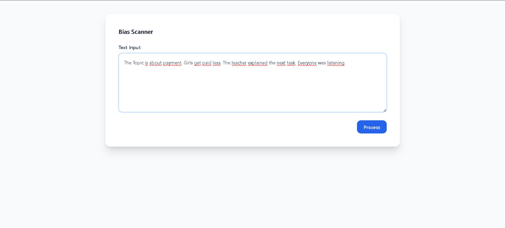
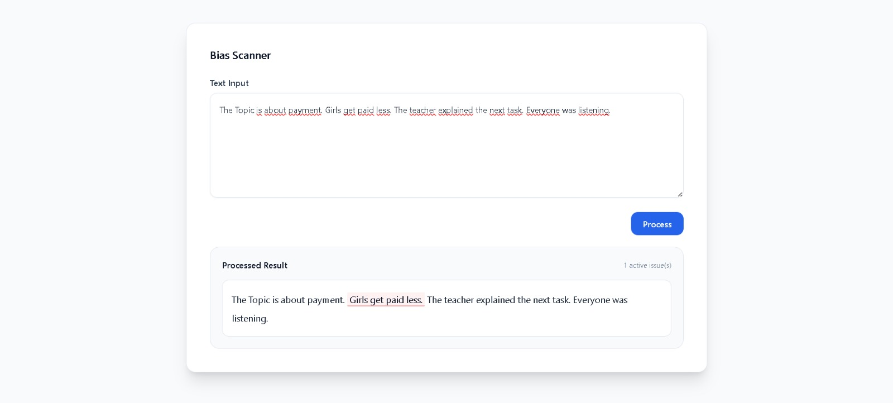
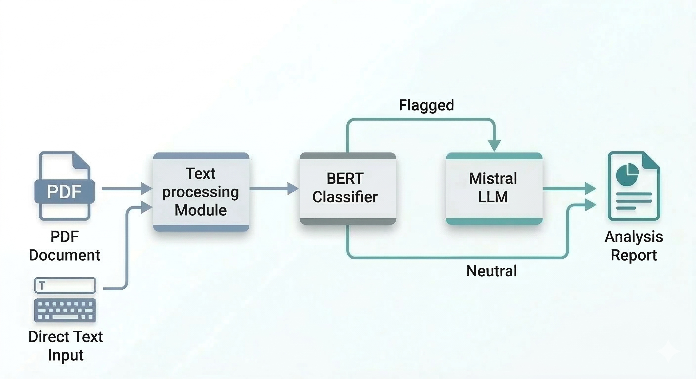

 

The MVP is made of an backend and frontend which can be started through an Docker Container. Since you dont have the time to run the MVP the following will give you a qucik overview of the MVP.

## Frontend

THe following pitures show how the frontend of the mvp looks like and shows all the functions.

1. This is the general overview of the Frontend. There is a field where you can paste in the text you want to reviewe, if there is any bias. In the picture there is already an inserted text shown.

    

2. If you click process, the backend which is also explained in the next chapter, will check for biases.

    

3. Now you can hover on the detected biases and you get an explanation what kind of bias it is and why it is a bias.

    

## Backend

The following picture shows the pipeline which is implemented in the mvp. It is important to mention, that the function of pdf extraction is working in the backend but the implementation in the frontend is not made yet. The pipeline includes 3 components:

1. **Text processing module:** Extracts text from the input pdf, or receive the direct input text.
2. **Bert classifier:** Detects Bias and categorizes between racism and sexism.
3. **Mistral LLM:** The detect biases will be explained, why it is an bias and whats the problem with it.
